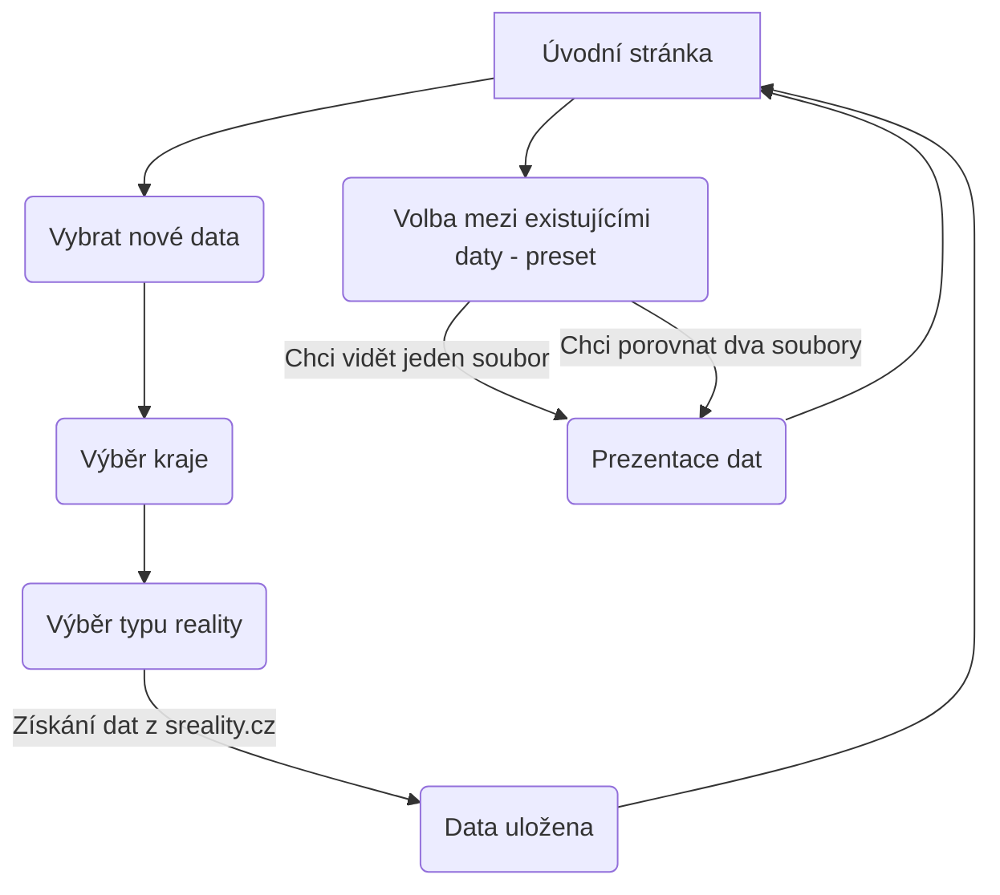

# TestGitWednesday
# Monitorování cen nemovitostí
- Semestrální práce 04/2023

### Motivace
- Téma jsem si vybral, protože mi přišly ceny realit zajímavé a zároveň jsem si chtěl vyzkoušet parsování reálných JSON dat z webových zdrojů.

### Popis problému

- Aplikace bude sbírat data ze stránky "sreality.cz" a následně si je uloží s datem sběru do souboru. 
- Později bude možné tento soubor zobrazit a porovnat stejné data s odlišnými daty sběru.
- Například zobrazí procentní nárust nebo pokles průměrné ceny.

## Řešení

| Dokumentace |                   |
| ------------- | ------------------------------ |
| Vytvořit readme.md      | 30%      |

| Data |                   |
| ------------- | ------------------------------ |
| Získat data z sreality.cz      | 0%      |
| Zdokumentovat získání specifických dat (reality, lokality) z sreality.cz      | 0%      |
| Uložit data do JSON souboru      | 0%      |
| Získat data z JSON souboru      | 0%      |
| Získat specifické data      | 0%      |

| Uživatelské rozhraní |                   |
| ------------- | ------------------------------ |
| Úvodní stránka     | 0%      |
| Tvorba nových dat     | 0%      |
| Prohlížení dat     | 0%      |
| Porovnání stejných nových a starých dat     | 0%      |

### Funkční specifikace
- Seznam funkcí z pohledu uživatele, které bude Váš program poskytovat např. formou větveného seznamu (stromu)
- Může sloužit následně jako podklad pro menu. Funkce očíslujte.

### Popis struktury vstupních a výstupních souborů
- Jaké datové typy budou obsahovat, čím budou odděleny jednotlivé údaje, jestli je požadovaný určitý formát názvů souborů a pod.

### Class diagram
- Diagram tříd
- Vygenerovat
- FlowChart?

## Testování

## Zdrojový kód
