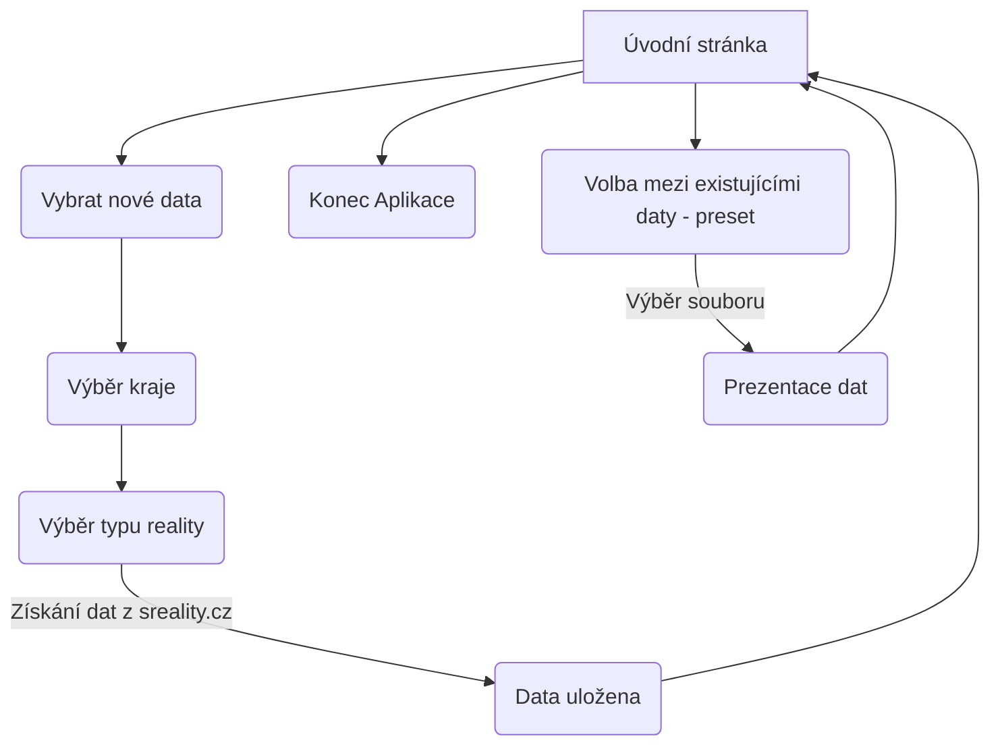
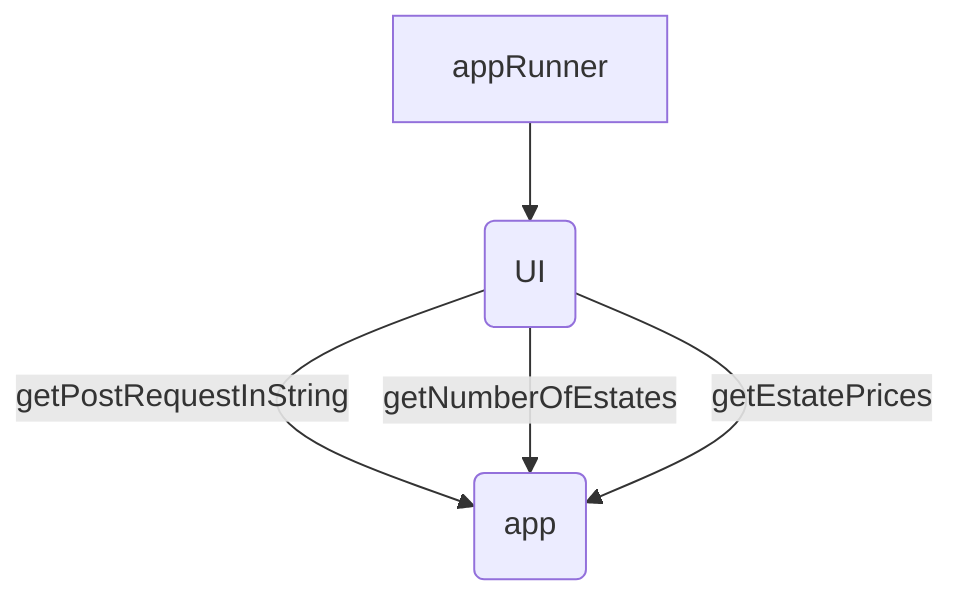

# Monitorování cen nemovitostí
- Semestrální práce 04/2023

### Motivace
- Téma statistiky cen realit jsem si vybral, protože mi přišly ceny realit zajímavé a zároveň jsem si chtěl vyzkoušet parsování reálných JSON dat z webových zdrojů.

### Popis problému

- Aplikace podle kritérií sesbírá data ze stránky "sreality.cz", zprůměruje ceny a uloží je do souboru.
- Umí tento soubor zobrazit a porovnat stejné data v průběhu času.
- Zobrazí procentní nárust nebo pokles průměrné ceny.

## Řešení

| Dokumentace |                   |
| ------------- | ------------------------------ |
| Vytvořit readme.md      | 90%      |

| Data |                   |
| ------------- | ------------------------------ |
| Získat data z sreality.cz      | 100%      |
| Zdokumentovat získání specifických dat (typ reality a lokality) z sreality.cz      | 100%      |
| Získat JSON data     | 100%      |
| Zpracovat data z JSON souboru     | 100%      |
| Uložit data do souboru     | 100%      |

| Uživatelské rozhraní |                   |
| ------------- | ------------------------------ |
| Úvodní stránka     | 100%      |
| Tvorba nových dat     | 100%      |
| Prohlížení dat     | 100%      |
| Porovnání stejných nových a starých dat     | 100%      |

### Funkční specifikace

### Popis struktury vstupních a výstupních souborů
- Jaké datové typy budou obsahovat, čím budou odděleny jednotlivé údaje, jestli je požadovaný určitý formát názvů souborů a pod.

### Class diagram

