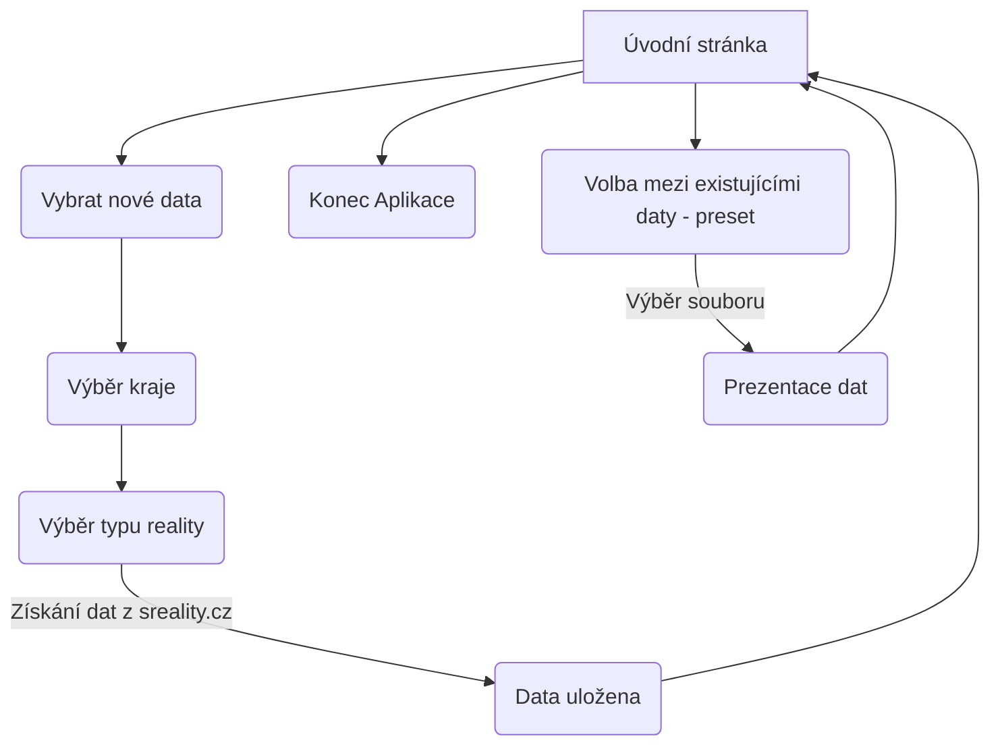
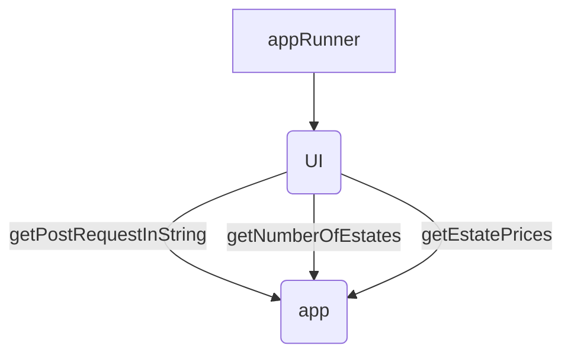

# Monitorování cen nemovitostí
- Semestrální práce 04/2023

### Motivace
- Téma statistiky cen realit jsem si vybral, protože mi přišly ceny realit zajímavé a zároveň jsem si chtěl vyzkoušet parsování reálných JSON dat z webových zdrojů.

### Popis problému

- Aplikace podle kritérií sesbírá data ze stránky "sreality.cz", zprůměruje ceny a uloží je do souboru.
- Umí tento soubor zobrazit a porovnat stejné data v průběhu času.
- Zobrazí procentní nárust nebo pokles průměrné ceny.

## Řešení

| Data |                   |
| ------------- | ------------------------------ |
| Získat data z sreality.cz      | 100%      |
| Zdokumentovat získání specifických dat (typ reality a lokality) z sreality.cz      | 100%      |
| Získat JSON data     | 100%      |
| Zpracovat data z JSON souboru     | 100%      |
| Uložit data do souboru     | 100%      |

| Uživatelské rozhraní |                   |
| ------------- | ------------------------------ |
| Úvodní stránka     | 100%      |
| Tvorba nových dat     | 100%      |
| Prohlížení dat     | 100%      |
| Porovnání stejných nových a starých dat     | 100%      |

### Funkční specifikace

### Popis struktury vstupních a výstupních souborů
- Soubory realit jsou pojmenovány podle typu nemovitosti. (v závislosti na API sreality

Zde jsou čísla API reprezentující typy a co znamenají:

| locality_region_id | Region                  |
| ----------------- | ----------------------- |
| 1                 | Jihočeský kraj          |
| 2                 | Plzeňský kraj           |
| 3                 | Karlovarský kraj        |
| 4                 | Ústecký kraj            |
| 5                 | Liberecký kraj          |
| 6                 | Královehradecký kraj    |
| 7                 | Pardubický kraj         |
| 8                 | Olomoucký kraj          |
| 9                 | Zlínský kraj            |
| 10                | Praha                   |
| 11                | Středočeský kraj        |
| 12                | Moravskoslezský kraj    |
| 13                | Vysočina                |
| 14                | Jihomoravský kraj       |

| category_main_cb | Kategorie                                |
| ---------------- | ---------------------------------------- |
| 1                | Byty                                     |
| 2                | Domy a nemovitosti                       |
| 3                | Pozemky                                  |
| 4                | Komerční nemovistosti a nevytové prostory |
| 5                | Ostatní nemovistosti                      |

| category_type_cb | Typ    |
| --------------- | ------ |
| 1               | Prodej |
| 2               | Pronájem|
| 3               | Dražba  |
| 4               | Podíl   |

per_page
- Množství 

| locality_district_id | District                |
| -------------------- | ----------------------- |
| 1                    | České Budějovice        |
| 2                    | Český Krumlov           |
| 3                    | Jindřichův Hradec       |
| 4                    | Písek                   |
| 5                    | Prachatice              |
| 6                    | Strakonice              |
| 7                    | Tábor                   |
| 8                    | Domažlice               |
| 9                    | Cheb                    |
| 10                   | Karlovy Vary            |
| 11                   | Klatovy                 |
| 12                   | Plzeň-město             |
| 13                   | Plzeň-jih               |
| 14                   | Plzeň-sever             |
| 15                   | Rokycany                |
| 16                   | Sokolov                 |
| 17                   | Tachov                  |
| 18                   | Česká Lípa              |
| 19                   | Děčín                   |
| 20                   | Chomutov                |
| 21                   | Jablonec nad Nisou      |
| 22                   | Liberec                 |
| 23                   | Litoměřice              |
| 24                   | Louny                   |
| 25                   | Most                    |
| 26                   | Teplice                 |
| 27                   | Ústí nad Labem          |
| 28                   | Hradec Králové          |
| 29                   | Chrudim                 |
| 30                   | Jičín                   |
| 31                   | Náchod                  |
| 32                   | Pardubice               |
| 33                   | Rychnov nad Kněžnou     |
| 34                   | Semily                  |
| 35                   | Svitavy                 |
| 36                   | Trutnov                 |
| 37                   | Ústí nad Orlicí         |
| 38                   | Zlín                    |
| 39                   | Kroměříž                |
| 40                   | Prostějov               |
| 41                   | Uherské Hradiště        |
| 42                   | Olomouc                 |
| 43                   | Přerov                  |
| 44                   | Šumperk                 |
| 45                   | Vsetín                  |
| 46                   | Jeseník                 |
| 47                   | nic                     |
| 48                   | Benešov                 |
| 49                   | Beroun                  |
| 50                   | Kladno                  |
| 51                   | Kolín                   |
| 52                   | Kutná Hora              |
| 53                   | Mladá Boleslav          |
| 54                   | Mělník                  |
| 55                   | Nymburk                 |
| 56                   | Praha-východ            |
| 57                   | Praha-západ             |
| 58                   | Příbram                 |
| 59                   | Rakovník                |
| 60                   | Bruntál                 |
| 61                   | Frýdek-Místek           |
| 62                   | Karviná                 |
| 63                   | Nový Jičín              |
| 64                   | Opava                   |
| 65                   | Ostrava-město           |
| 66                   | Havlíčkův Brod          |
| 67                   | Jihlava                 |
| 68                   | Pelhřimov               |
| 69                   | Třebíč                  |
| 70                   | Žďár nad Sázavou        |
| 71                   | Blansko                 |
| 72                   | Brno-město              |
| 73                   | Brno-venkov             |
| 74                   | Břeclav                 |
| 75                   | Hodonín                 |
| 76                   | Vyškov                  |
| 77                   | Znojmo                  |

### Class diagram

